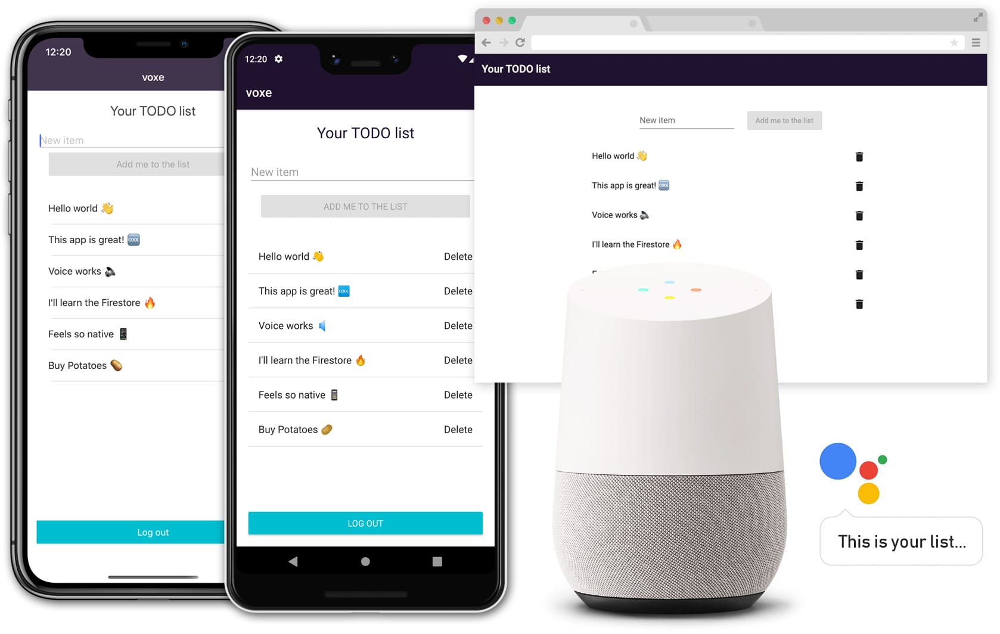
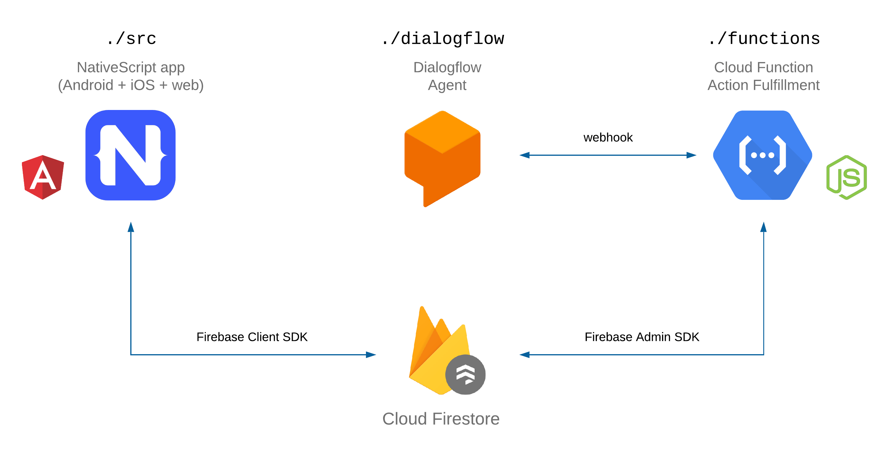

# VOXE: VOice X-platform Experience

VOXE is a simple proof-of-concept to-do list app for Android, iOS, web and the Google Assistant built with [NativeScript](https://www.nativescript.org/), [Firebase](https://firebase.google.com/) and [Actions on Google](https://developers.google.com/assistant).

  

This repository contains:

 - A NativeScript (Angular) app that compiles to Android, iOS and web
 - A Dialogflow agent
 - A Cloud Function for the Google Action fulfillment

  

## Nativescript app

### Install

    $ npm install

### Develop

For web, run:

    $ npm start

Visit [http://localhost:4200](http://localhost:4200).

Use `npm run android` and `npm run ios` to run the Android and iOS apps, respectively.

### Build

    $ npm build

## Dialogflow Agent

An export of the Dialogflow Agent is available in [dialogflow](dialogflow).

## Action Fulfillment

The implementation of the fulfillment for the Google Action lives in [functions](functions).
